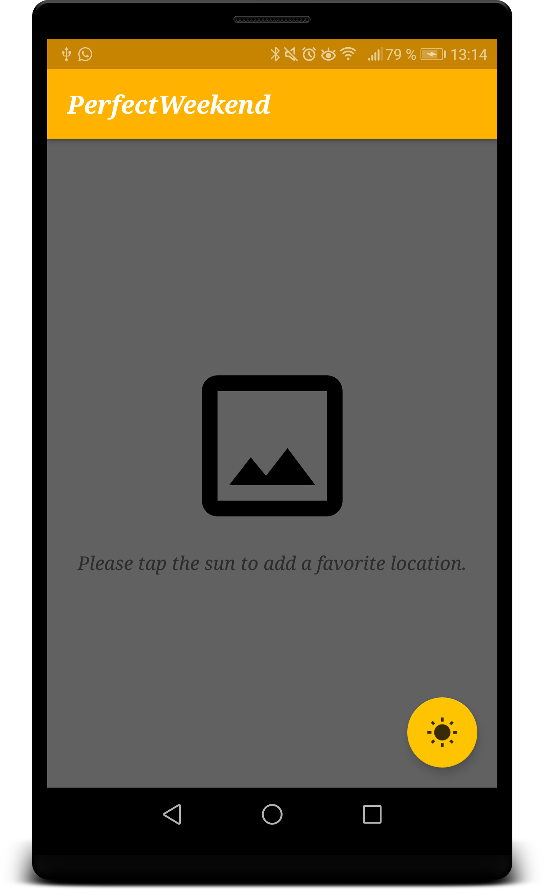
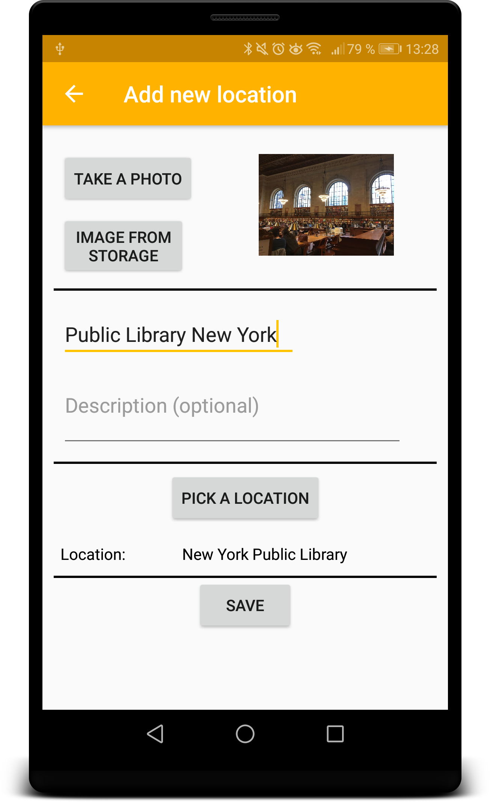
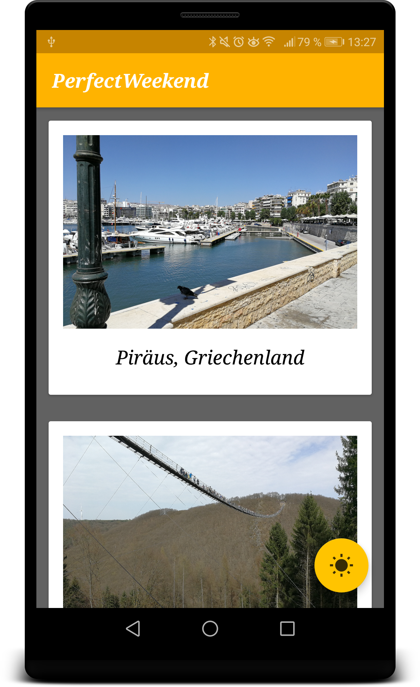
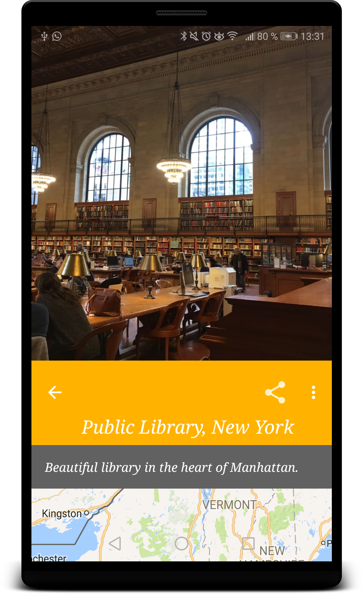
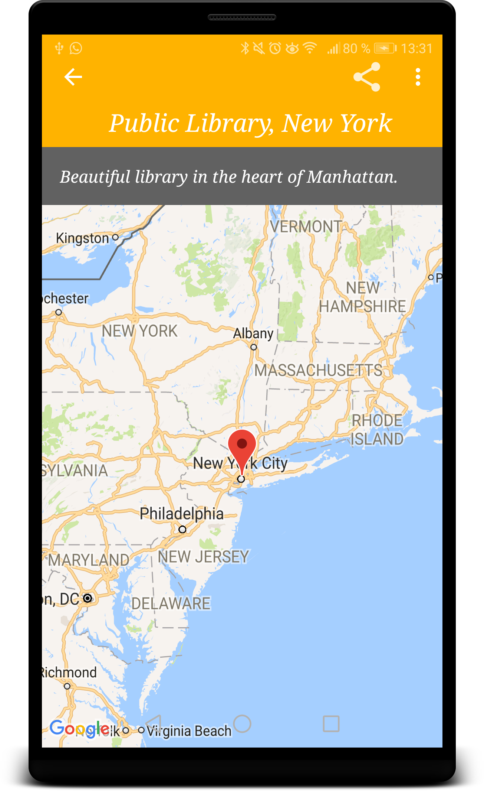
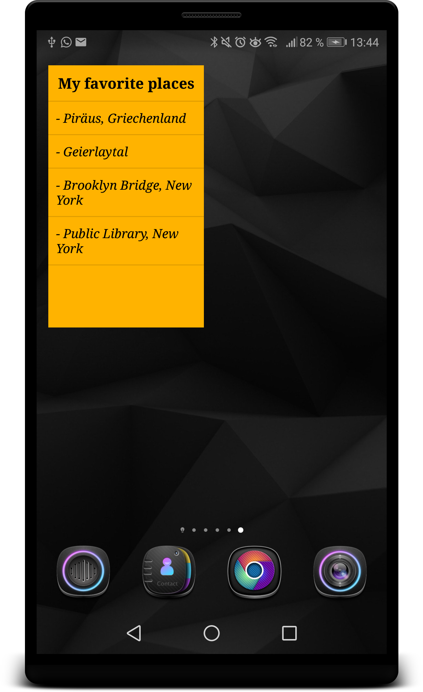

# PerfectWeekend
 
We all know this situation on weekends: The sun is shining and the birds are singing so it’s the perfect time to do a trip with 
friends or family. But where should you go? How about a picnic at this beautiful lake in this nice little town you were a few years ago? 
Or how about this cute art café with the delicious chocolate cappuccino you were last year? But how was the cafè called? 
You can’t remember the name of the little town either not to mention finding this perfect picnic spot at the lake you were last time. 
 
“PerfectWeekend” can help! Everytime you find a perfect spot that you want to visit again in the future, 
just add it to “PerfectWeekend” by taking a photo and adding a short title. You can even add longer notes if you want to! 
The app will save the coordinates of the location for you so that you always know how to get back to your favorite spot and 
you can also browse through an album of all the places you added to pick a couple of spots for your next perfect weekend. 
Where other apps set the focus on presenting new places to the user or sharing certain locations with others, 
“PerfectWeekend” specializes in preserving your favorite spots. 
 
In MainActivity the user can add a favorite location by tapping the sun button:

In the EditorActivity the user can add an image from the storage or take a new on and
add a title and description. The user also has to pick a location via a Google place picker.
The data gets stored into a SQLite database via a content provider:

The list in the MainActivity gets populated by the database with the help of a cursor loader.
The locations get presented in the style of polaroid photos:

By tapping on of the card views the DetailActivity gets opened via a 
shared item transition. The entered informations are presented to the user.
The user can see the position of the location via Google Maps. The share button 
allows to share the image and title with friends. The options menu allows 
to edit or delete the location:

The widget presents a minimalistic list of the favorite places. If the user taps
on one of the places the DetailActivity opens:

